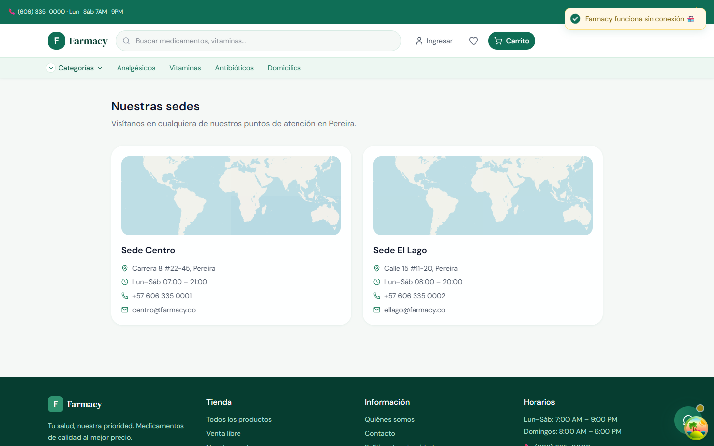

# 🌿 Farmacy — Sistema de Gestión de Farmacias (SGF)

> 🚨 **Este proyecto SOLO usa `pnpm` como gestor de paquetes.** No uses `npm` ni `yarn` — los lockfiles no existen, los scripts fallarán, y el workspace monorepo no funcionará. Todo está configurado y verificado con `pnpm`. Si no lo tienes instalado: `corepack enable pnpm`.

[](https://www.typescriptlang.org/)
[](https://pnpm.io/)
[](https://reactjs.org/)
[](https://expressjs.com/)
[](https://www.prisma.io/)
[](https://vitejs.dev/)
[](backend/src/__tests__/)
[](LICENSE)

**Farmacy** es un sistema de gestión farmacéutica completo con tienda B2C integrada, panel administrativo POS, control de inventario FEFO (*First Expired, First Out*), programa de fidelidad con puntos, y múltiples pasarelas de pago (Wompi, Stripe, MercadoPago, Efectivo). Desarrollado como proyecto académico para la **Universidad Tecnológica de Pereira (UTP)**.

---

## 📸 Screenshots — funcionamiento real

> Capturas tomadas de la aplicación corriendo (backend + PostgreSQL + React), con ventas y datos reales de los seeds. Nada maquetado.

### 🛒 Cliente (tienda B2C)

| | |
|---|---|
| **Home** — catálogo vivo conectado al inventario real, recomendados del día y categorías. |  |
| **Catálogo** — filtros por categoría, laboratorio, precio y venta libre/Receta Médica (RX). Búsqueda **sin acentos**: `acetaminofen` encuentra `Acetaminofén`. |  |
| **Carrito** — persistente (localStorage), control de stock máximo por producto y aviso de RX. |  |
| **Checkout — datos de envío** — cliente autenticado (el seed crea `cliente@ejemplo.co`). |  |
| **Checkout — pasarelas de pago** — Wompi (PSE/Nequi/tarjetas), Stripe, MercadoPago, Efectivo y Transferencia. |  |
| **Ficha de producto** — información INVIMA/CUM, indicaciones, contraindicaciones, alérgenos y lotes disponibles. |  |
| **Mi cuenta — pedidos** — historial de compras y puntos del programa de fidelidad. |  |
| **Sucursales** — sedes físicas con horarios y contacto. |  |

### 🖥️ Administrador

| | |
|---|---|
| **Login empleados** — RBAC (Administrador / Farmacéuta / Auxiliar). En escritorio (Tauri/Electron) incluye el campo **"Servidor de la empresa"** para conectar el POS a la nube/VPS. |  |
| **Dashboard** — ventas del día en vivo (WebSocket/SSE), KPIs y alertas de inventario. |  |

### 🧾 Punto de Venta (POS) — offline-first

| | |
|---|---|
| **Búsqueda instantánea** — resultados con stock, precio y RX; atajos F2 (cobrar), F4 (limpiar), F5 (caja), F8 (buscar). Compatible con lector de códigos de barras USB (emula teclado + Enter). |  |
| **Venta en curso** — carrito con Acetaminofén + Ibuprofeno, descuentos, métodos de pago y total. Al cobrar se verifica **interacción medicamentosa** antes de registrar. |  |
| **Ticket electrónico** — tirilla generada por la venta #F-000118 real ($11.100): cajero, items, método de pago e impresión. |  |

> Sin internet, el cobro funciona igual: la venta queda en el **outbox local (IndexedDB)** y se sincroniza con idempotencia al reconectar — sin duplicar stock.

### 📦 Inventario y compras

| | |
|---|---|
| **Lotes FEFO** — vencimientos y stock por lote; el POS descuenta primero el lote más próximo a vencer. |  |
| **Órdenes de compra** — proveedores, recepción de mercancía y generación automática de lotes. |  |
| **Nueva orden** — alta de compras con múltiples productos y costos. |  |

### 👥 Farmacéuta y clientes

| | |
|---|---|
| **Clientes** — historial, perfil de salud (alérgenos) y datos de contacto. |  |
| **Programa de fidelidad** — 1 punto por $100 COP, canje y expiración automática. |  |

---
## ✨ Características principales

### 🏪 Tienda B2C (pública)
- Catálogo de productos con filtros por categoría, laboratorio, precio y receta médica
- Carrito de compras con verificación FEFO + alertas de alérgenos
- Autenticación por email + **Google OAuth**
- **Programa de puntos / fidelidad** — 1 punto por cada $100 COP gastados
- **Chatbot** de atención al cliente con horario configurable
- **SSR/SSG** — Pre-renderizado de top 100 productos + categorías populares
- Perfil de salud del cliente (alérgenos, condiciones preexistentes)

### 🏥 Panel Administrativo (POS)
- **Punto de Venta (POS)** con búsqueda y escaneo de productos
- **Control de Caja**: apertura/cierre con arqueo y descuadres
- **Inventario FEFO**: gestión de lotes con fechas de vencimiento
- **Compras y Proveedores**: órdenes de compra y recepción de mercancía
- **Clientes**: historial de compras, fidelidad, devoluciones
- **Empleados**: gestión de usuarios con **RBAC** (ADMINISTRADOR / FARMACEUTA / AUXILIAR)
- **Reportes**: ventas, inventario, compras, exportación CSV
- **Tiempo real**: WebSocket + SSE para dashboard en vivo + POS concurrente
- **Notificaciones Push**: alertas de inventario en tiempo real multi-dispositivo

### 💳 Pagos (4 pasarelas)

| Pasarela | Sandbox | Estado |
|---|---|---|
| **Wompi** (Colombia) | `pub_test_*`, `prv_test_*` | ✅ Anti-replay + HMAC |
| **Stripe** | `pk_test_*`, `sk_test_*` | ✅ Webhook con firma |
| **MercadoPago** | `TEST-*` access token | ✅ Sandbox configurado |
| **Efectivo** (POS) | — | ✅ Sin pasarela externa |

### 🔐 Seguridad
- **RBAC**: 3 roles con permisos granulares
- **JWT** con refresh token rotation y blacklisting en Redis
- **Rate limiting** por endpoint (auth: 10/min, webhook: 60/min, búsqueda: 60/min)
- **Anti-replay**: nonce + timestamp + HMAC en webhooks de pago
- **Secret scanning**: GitHub Actions con Gitleaks en todos los PRs
- **Contraseñas**: hasheadas con bcryptjs

---

## 🏗️ Arquitectura

```
Farmacy/
├── backend/                # API REST (Express + TypeScript + Prisma)
│   ├── src/modules/        # 19 módulos (auth, productos, ventas, caja, etc.)
│   ├── src/services/       # Servicios compartidos (inventario, SSE, WebSocket)
│   ├── src/__tests__/      # 30 archivos, 578 tests (+12 de integración)
│   └── src/jobs/           # BullMQ workers (alertas, export CSV)
├── frontend/               # SPA/PWA (React 19 + Vite 6 + Tailwind CSS 4)
│   ├── src/pages/tienda/   # 15 páginas B2C
│   ├── src/pages/admin/    # 20+ páginas administrativas
│   ├── src/pages/auth/     # 7 páginas de autenticación
│   └── src-tauri/          # Empaquetado escritorio Tauri v2 (.exe)
├── desktop/                # Empaquetado Electron (portable .exe)
├── database/               # Prisma schema (17 modelos) + Seeds + SQL queries
├── docs/                   # Documentación técnica
├── e2e/                    # Tests E2E con Playwright
├── docker-compose.dev.yml  # Postgres + Redis + pgAdmin (desarrollo)
├── docker-compose.yml      # Producción completa (backend + frontend + DB)
├── run.ps1                 # Inicio rápido — PowerShell (recomendado)
├── setup.bat               # Setup inicial (Windows)
├── setup.sh                # Setup inicial (Linux / macOS)
└── .env.example            # Template de variables de entorno
```

---

## 💾 Persistencia de Datos

**Sí, los datos sobreviven a reinicios y caídas.** La arquitectura garantiza persistencia en 3 capas:

| Capa | Tecnología | Volumen Docker | ¿Sobrevive a reinicio? |
|---|---|---|---|
| **PostgreSQL** | postgres:15-alpine | `farmacy_pg_data_dev` | ✅ **Sí** — datos en disco del host |
| **Redis** | redis:7-alpine + AOF | `farmacy_redis_data_dev` | ✅ **Sí** — append-only file en disco |
| **Carrito B2C** | Zustand + localStorage | — | ✅ **Sí** — persiste en navegador |

> **⚠️** `docker compose down -v` borra los volúmenes y **TODOS los datos se pierden**. No uses `-v` a menos que quieras resetear la base de datos.

---

## 💰 Programa de Fidelidad

| Concepto | Valor |
|---|---|
| **Ganancia** | 1 punto por cada $100 COP de la base pagada (excluye envío) — `PUNTOS_POR_PESO` en `config_param` |
| **Canje** | 1 punto = $1 COP de descuento en la próxima compra |
| **Expiración** | `PUNTOS_VIGENCIA_DIAS` (365) desde la última compra — job diario de expiración |
| **Asignación** | Automática en `VentasService.registrarVenta()` — transacción atómica, server-side |
| **Devoluciones** | Revierten puntos ganados y re-creditan puntos usados de la venta |
| **Anti-fraude** | `puntosUsados` se recorta al saldo real; cupones validados y aplicados solo en el backend |

---

## 🚀 Inicio rápido

### Prerrequisitos

| Herramienta | Versión | Cómo verificar |
|---|---|---|
| [Node.js](https://nodejs.org/) | ≥ 18 | `node --version` |
| [pnpm](https://pnpm.io/) | ≥ 8 | `pnpm --version` |
| [Docker](https://docs.docker.com/engine/install/) | Cualquiera | `docker info` |

> **⚠️ Windows:** Usa [Docker Desktop](https://www.docker.com/products/docker-desktop/).

### Windows (PowerShell)

```powershell
# 1. Clonar el repositorio
git clone https://github.com/SCP-00/farmacy-erp.git
cd farmacy-erp

# 2. Configurar variables de entorno
cp .env.example .env
# Edita .env con tus valores reales
# REQUERIDO: DATABASE_URL, JWT_SECRET, JWT_REFRESH_SECRET, JWT_CLIENTE_SECRET

# 3. Iniciar PostgreSQL y Redis con Docker
docker compose -f docker-compose.dev.yml up -d

# 4. Setup automático (instala dependencias, genera Prisma, corre seeds)
setup.bat

# 5. Iniciar backend y frontend
.\run.ps1

# 6. Abrir en el navegador
#    Tienda: http://localhost:5173
#    Admin:  http://localhost:5173/admin/login
```

### Linux / macOS

```bash
# 1. Clonar el repositorio
git clone https://github.com/SCP-00/farmacy-erp.git
cd farmacy-erp

# 2. Configurar variables de entorno
cp .env.example .env
# Edita .env con tus valores reales

# 3. Iniciar PostgreSQL y Redis con Docker
docker compose -f docker-compose.dev.yml up -d

# 4. Setup automático
chmod +x setup.sh && ./setup.sh

# 5. Iniciar backend (Terminal 1)
cd backend && pnpm run dev

# 6. Iniciar frontend (Terminal 2)
cd frontend && pnpm run dev

# 7. Abrir en el navegador
#    Tienda: http://localhost:5173
#    Admin:  http://localhost:5173/admin/login
```

---

## 📥 Instalar como aplicación (PWA / .exe)

Farmacy se distribuye en **tres formatos** que comparten el mismo backend y la misma lógica offline del POS:

| Formato | Descarga / instalación | Ideal para |
|---|---|---|
| 🌐 **PWA instalable** | Chrome/Edge → "Instalar aplicación" en la web desplegada | Prueba rápida, sin descargas |
| ⚡ **Tauri** (recomendado) | [`Farmacy_1.0.0_x64-setup.exe` (2,3 MB)](https://github.com/SCP-00/farmacy-erp/releases/latest) | Producción en sucursal |
| 🐘 **Electron portable** | [`Farmacy-Portable-1.0.0.exe` (74 MB)](https://github.com/SCP-00/farmacy-erp/releases/latest) | Equipos donde no se puede instalar nada |

> El POS de escritorio conecta con tu servidor (nube, VPS o `localhost`) desde el campo **"Servidor de la empresa"** del login, y funciona **sin internet**: las ventas quedan en cola local y se sincronizan con idempotencia al reconectar.

📖 Guía completa de empaquetado, compilación y configuración de servidor: **[docs/packaging-desktop.md](docs/packaging-desktop.md)**

Compilar localmente:

```bash
# Tauri (requiere Rust ≥ 1.77)
cd frontend && pnpm install && pnpm exec tauri build
# → frontend/src-tauri/target/release/bundle/nsis/Farmacy_1.0.0_x64-setup.exe

# Electron portable
cd desktop && pnpm run dist
# → desktop/dist-electron/Farmacy-Portable-1.0.0.exe
```

---

## 🔧 Variables de entorno

### Requeridas

| Variable | Propósito |
|---|---|
| `DATABASE_URL` | Conexión a PostgreSQL |
| `JWT_SECRET` | Firma de tokens JWT (mín. 32 caracteres) |
| `JWT_REFRESH_SECRET` | Firma de refresh tokens (mín. 32 caracteres) |
| `JWT_CLIENTE_SECRET` | Firma de tokens de clientes (mín. 32 caracteres) |

### Opcionales

| Variable | Funcionalidad |
|---|---|
| `GOOGLE_CLIENT_ID`, `GOOGLE_CLIENT_SECRET` | Google OAuth — login social |
| `SMTP_HOST`, `SMTP_USER`, `SMTP_PASS` | Envío de emails (verificación, recuperación de password) |
| `WOMPI_PUBLIC_KEY`, `WOMPI_PRIVATE_KEY`, `WOMPI_INTEGRITY_KEY` | Pagos Wompi (Colombia) |
| `STRIPE_PUBLIC_KEY`, `STRIPE_SECRET_KEY`, `STRIPE_WEBHOOK_SECRET` | Pagos Stripe |
| `MERCADOPAGO_ACCESS_TOKEN`, `MERCADOPAGO_PUBLIC_KEY` | Pagos MercadoPago |
| `VAPID_PUBLIC_KEY`, `VAPID_PRIVATE_KEY` | Notificaciones Push |

### Credenciales de desarrollo (seeds)

| Rol | Email | Contraseña |
|---|---|---|
| Administrador | `admin@farmacy.co` | `Admin@1234` |
| Farmacéuta | `farmaceuta@farmacy.co` | `Farm@1234` |
| Auxiliar | `auxiliar@farmacy.co` | `Aux@1234` |
| Cliente demo | `cliente@ejemplo.co` | `Cliente@1234` |

---

## 🧪 Tests

| Suite | Comando | Tests |
|---|---|---|
| Backend (unit) | `cd backend && pnpm test` | 578 tests |
| Backend (integración, DB real) | `cd backend && pnpm run test:integration` | 12 tests |
| Frontend | `cd frontend && pnpm test` | 103 tests |
| E2E | `pnpm run e2e` | Playwright con Chromium |

> Los tests de integración ejecutan la cadena completa contra PostgreSQL real: FEFO atómico `FOR UPDATE`, idempotencia offline (`ventas_sync`), cupones server-side y búsqueda sin acentos (migración `unaccent`).

---

## 📚 Documentación

| Documento | Descripción |
|---|---|
| [docs/architecture.md](docs/architecture.md) | Arquitectura detallada del sistema |
| [docs/api-routes.md](docs/api-routes.md) | 72 endpoints, 40+ páginas, matriz RBAC |
| [docs/features/b2c.md](docs/features/b2c.md) | B2C, persistencia, puntos de fidelidad |
| [docs/features/payments.md](docs/features/payments.md) | Pasarelas de pago, efectivo, contra entrega |
| [docs/security/compliance.md](docs/security/compliance.md) | Pentest, seguridad, INVIMA, persistencia DB |
| [docs/deploy-guide.md](docs/deploy-guide.md) | Guía paso a paso para deploy en VPS con Docker |
| [docs/monitoreo.md](docs/monitoreo.md) | Rutina operativa de monitoreo y checklist de deploy |
| [docs/packaging-desktop.md](docs/packaging-desktop.md) | Empaquetado .exe/PWA: Tauri, Electron, configuración de servidor |
| [docs/adr/0004-pos-offline-first.md](docs/adr/0004-pos-offline-first.md) | ADR del POS offline-first (outbox, idempotencia, fases) |

---

## 🔐 Seguridad

> ⚠️ Este repositorio está diseñado para ser público.

| Medida | Estado |
|---|---|
| `.env` en `.gitignore` | ✅ Ignorado por git |
| `.env.example` con placeholders | ✅ Valores genéricos, seguros para commit |
| Seeds con datos ficticios | ✅ Solo datos demo de desarrollo |
| Sin API keys en código fuente | ✅ Todas las claves vía variables de entorno |
| Secret scanning automático | ✅ Gitleaks en todos los PRs |

### Antes de hacer público el repo

1. **Rotar secrets de desarrollo** — Genera nuevas claves en cada consola.
2. **Verificar historial de git:**
   ```bash
   git log --all -p -S "sk_test_" -- .env
   ```
3. **Configurar Google OAuth** manualmente en [Google Cloud Console](https://console.cloud.google.com/apis/credentials).

---

## 💵 Invariantes de seguridad (hardening de dinero)

> Reglas que NO se pueden romper al agregar features. Los tests las protegen.

1. **Montos y precios SIEMPRE server-side** — el cliente solo envía `productoId`, `cantidad`, código de cupón y puntos a usar. Wompi/Stripe/MercadoPago toman el monto de la venta en DB.
2. **Puntos** — `puntosUsados` se recorta al saldo real del cliente (anti-fraude); regla de ganancia única en `VentasService.registrarVenta()`.
3. **Cupones** — se validan y aplican solo contra la tabla `codigos_descuento` (vigencia, usos máximos, incremento atómico). Preview: `POST /api/v1/cupones/validar`.
4. **FEFO atómico** — `SELECT FOR UPDATE` + decrement revalidado dentro del lock; sin ventas duplicadas de stock.
5. **Pedidos huérfanos** — ventas B2C `PENDIENTE` sin pago aprobado tras 24h se marcan `EXPIRADO` y liberan stock (job horario).
6. **Config de negocio** — umbrales, tarifas y reglas viven en `config_param` (DB), no hardcodeadas.

---

## 🐳 Docker

### Desarrollo (solo DB)

```bash
docker compose -f docker-compose.dev.yml up -d
```

PostgreSQL 15 (puerto 5432), Redis 7 (6379), pgAdmin (5050).

### Producción (full stack)

```bash
docker compose up -d --build
```

Backend + Frontend + PostgreSQL + Redis + Caddy (SSL automático).

---

## 📄 Licencia

MIT — Ver [LICENSE](LICENSE) para más detalles.

---

## 🏫 Proyecto académico

Desarrollado para la **Universidad Tecnológica de Pereira (UTP)** — Ingeniería de Sistemas y Computación.
